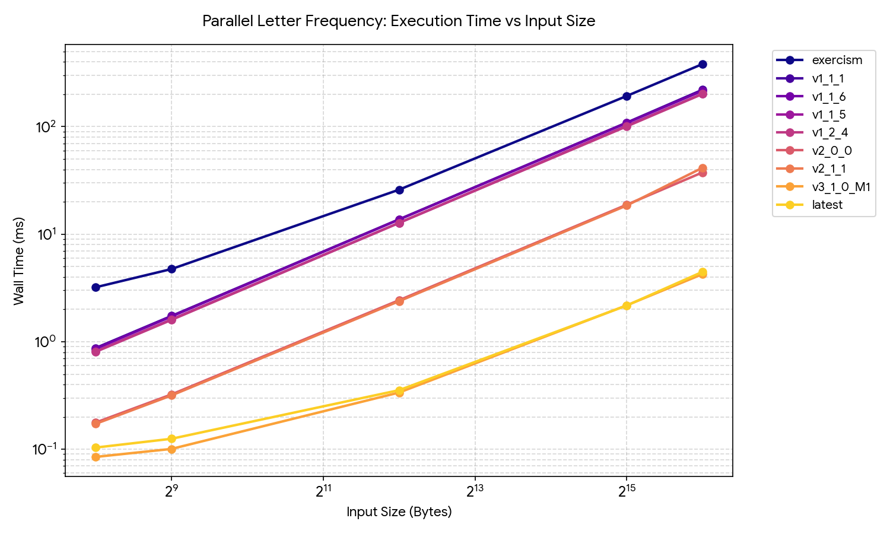

# Parallel Letter Frequency: High-Performance C++ Implementation

A state-of-the-art, highly optimized C++ implementation for counting letter frequencies in text views in parallel. This project demonstrates extreme optimization techniques at both the software concurrency level and the hardware CPU/microarchitecture level, with a primary focus on Apple Silicon (macOS) and modern multicore processors.

---

## 1. Architectural Approach

The solution implements a **high-throughput, memory-resident Map-Reduce** model tailored to modern CPU cache and execution pipeline architectures:

### Concurrency & Dynamic Load Balancing
*   **Asymmetric Core Optimization:** Apple Silicon utilizes heterogeneous architectures with Performance (P) and Efficiency (E) cores. Static workload partitioning causes slower E-cores to bottleneck the overall execution (straggler effect). 
*   **Dynamic Work-Stealing/Granular Scheduling:** Instead of static chunking, worker threads dynamically query a global atomic index (`std::atomic<size_t>`) to acquire work in small batches (e.g., 16 strings). This balances the scheduler's atomic overhead with the hardware's heterogeneous processing speed, maximizing multi-core throughput.

### Memory & Cache Line Optimization
*   **False Sharing Elimination:** In multi-threaded environments, threads writing to adjacent memory addresses residing on the same cache line force CPU cache-coherency cycles (invalidating lines across L1/L2 caches). The local thread accumulators (`frequency_map`) are aligned to the CPU's specific L1 cache line size using `alignas(VT_CACHE_LINE)` (128 bytes on Apple Silicon, 64 bytes on x86_64).
*   **Memory Bandwidth Utilization:** The main loop avoids unnecessary heap allocation or locking. Threads process strings entirely in registers or L1 cache, aggregating results into thread-local maps, and perform a single lock-free reduction at the end.

### Microarchitectural Instruction Pipelining
*   **Branchless Lookup Table (LUT):** Character classification (`[A-Za-z]`) and folding are performed branchlessly in $O(1)$ time. This prevents CPU pipeline stalls caused by branch mispredictions.
*   **4-Way Loop Unrolling:** The fallback scalar loop is unrolled four times to expose instruction-level parallelism (ILP) to the CPU out-of-order execution engine, saturating the multiple arithmetic logic units (ALUs).

### Hardware-Accelerated Vectorization (Apple Silicon)
*   **Apple Accelerate vImage Integration:** On macOS, the implementation utilizes the native `vImageHistogramCalculation_Planar8` function. This leverages the hardware's vector units (NEON and Apple's proprietary AMX coprocessor) to count all 256 byte values directly at/near memory bandwidth (~15–30 GB/s), bypassing scalar loop instructions entirely.

---

## 2. Evolution of Versions

The codebase contains several historical iterations, allowing performance comparison:

1.  **`exercism` / `v1.x.x` (Baseline):** Standard C++ map-reduce using associative containers (`std::map`), which suffers from node allocation overheads, pointer chasing, and heavy locking/synchronization.
2.  **`v2.0.0` & `v2.1.1`:** Shift to contiguous array-based frequency tables (`std::array<size_t, 32>`) and branchless ASCII LUTs. Introduces parallel algorithms (`std::transform_reduce` with execution policies).
3.  **`v3.0.0` (`latest` root baseline):** Introduces cache-line alignment to prevent false sharing and 4-way scalar loop unrolling to maximize pipeline occupancy.
4.  **`v3.1.0_M1` (Apple Silicon Optimized):** Integrates the Apple Accelerate framework for hardware-accelerated histogram calculation and uses atomic-based dynamic load-balancing for asymmetric cores.

---

## 3. How to Build

The project uses CMake as its build system. A modern compiler supporting C++23 is recommended.

### Prerequisites

*   **macOS:** The Accelerate framework is included natively with macOS. If you wish to build with TBB (Threading Building Blocks) for standard parallel execution policies, install it via Homebrew:
    ```bash
    brew install tbb
    ```
*   **Linux:** Install the Threading Building Blocks library:
    ```bash
    sudo apt-get install libtbb-dev
    ```

### Compilation

Create a build directory, configure CMake, and compile the targets:

```bash
# Configure with tests and benchmarks enabled
cmake -B build -S . -DCMAKE_BUILD_TYPE=Release -DEXERCISM_RUN_ALL_TESTS=ON -DEXERCISM_INCLUDE_BENCHMARK=ON

# Compile the project
cmake --build build
```

---

## 4. How to Run

### Running Unit Tests
To run the Catch2-based test suite and verify implementation correctness:
```bash
./build/parallel-letter-frequency
```

### Running Benchmarks
To run the microbenchmarks comparing the latest implementation against historical baselines:
```bash
# Navigate to the benchmark folder and compile
cmake -B bench/build -S bench/ -DCMAKE_BUILD_TYPE=Release
cmake --build bench/build

# Execute Google Benchmark
./bench/build/benchmark_parallel_letter_frequency
```

---

## 5. Performance Deep Dive: C++20 Coroutines vs. Thread-Parallel Map-Reduce

This section analyzes the performance impact of C++20 coroutines on the parallel letter frequency algorithm. It evaluates the architectural and hardware-level reasons why introducing coroutines for this specific task degrades performance compared to our optimized thread-parallel model.

### Microarchitectural Bottlenecks of C++20 Coroutines

C++20 coroutines are stackless, meaning their local execution state must be preserved in a heap-allocated **coroutine frame** rather than the standard function call stack. When applied to high-throughput, CPU-bound computations, three major sources of overhead emerge:

#### A. Dynamic Heap Allocation & HALO Failures
Every time a coroutine is invoked, a promise object and a coroutine frame containing local variables, parameters, and register state must be allocated. 
While compilers attempt **HALO (Heap Allocation Elision Optimization)** to place the coroutine frame on the caller's stack, HALO is fragile. It fails when coroutines cross thread boundaries (e.g., when dispatched across a thread pool or run asynchronously). This forces expensive `malloc`/`free` operations for every text chunk, serializing threads on the global allocator lock.

#### B. Register Spilling to Heap Memory
In our optimized unrolled loop, CPU registers (`X0-X31` on ARM64) hold the active counters and accumulators (`a0`, `a1`, etc.).
A coroutine must preserve its state across suspension points. Consequently, the compiler is forced to spill all local registers into the coroutine frame in memory before suspension and reload them upon resume, replacing ultra-fast register/L1 cache operations with pointer-chasing memory writes.

#### C. Indirect Jumps and Pipeline Flushes
Suspending and resuming a coroutine requires saving the instruction pointer, jumping to the caller/resumer via an indirect pointer in `std::coroutine_handle<>`, and executing a compiler-generated state switch statement on resume. These indirect jumps defeat CPU branch predictors and incur pipeline flushes.

### Microarchitectural Hardware Comparison

| Microarchitectural Dimension | Current Optimized Loop | Coroutine-Based Loop |
| :--- | :--- | :--- |
| **Data Locality** | Stack and L1 cache resident. Extremely high spatial/temporal locality. | Heap resident coroutine frame. Indirection and pointer chasing. |
| **SIMD / Auto-Vectorization** | High. Compiler can vectorize loop strides (using `#pragma clang loop vectorize(enable)`). | None. Suspension points block vectorization engines completely. |
| **Pipeline Efficiency** | Maximized. 4-way independent execution paths saturate multiple ALU pipes. | Low. Frequent branch mispredictions due to indirect jumps and state switches. |
| **Instruction Cache (I-cache)** | Tiny footprint. The loop fits in a few cache lines. | Large. State machine boilerplate, handle wrappers, and allocator code bloat the I-cache. |

### Design Scenarios & Why Coroutines Fail Here

#### Scenario A: Coroutine-Based Character Generator (`co_yield`)
If we wrote a coroutine generator to yield characters or words one-by-one:
```cpp
auto char_generator(string_view str) -> generator<char> {
    for (char c : str) {
        co_yield c; // Suspend and yield character
    }
}
```
In this scenario, a 1 MiB text requires **1,048,576 suspend-and-resume cycles**. 
*   **Direct loop cost:** Processing 1 MiB takes about **0.17 ms** (~0.17 nanoseconds per character).
*   **Coroutine generator cost:** Each `co_yield` takes ~15–30 nanoseconds. The generator would take **15–30 ms** per MiB—a slowdown of **~100x**.

#### Scenario B: Coroutine Tasks Scheduled on a Thread Pool (`co_await`)
If we chunk the texts and use coroutines to schedule the map tasks:
```cpp
auto count_chunk_async(record_type const& rec, size_t start, size_t end) -> Task<frequency_map> {
    auto local_map = frequency_map{};
    for (auto i = start; i < end; ++i) {
        local_map.insert(rec[i]);
    }
    co_return local_map;
}
```
Since the work inside each task is entirely compute-bound, the coroutine has no occasion to suspend itself during computation (there is no asynchronous waiting).
*   Without suspension, the coroutine behaves like a standard function but with the overhead of promise initialization, heap-allocating the coroutine frame, and wrapping the result in a future/handle.
*   **Result:** `std::async` or standard parallel execution policies (`std::execution::par_unseq`) reuse a highly optimized thread pool (like Intel TBB) with lock-free work-stealing, bypassing the coroutine layer's memory allocations and control-flow overhead.

---

## 6. Performance Visualization & Benchmark Results

Below is the visualization of the Google Benchmark runs comparing the different iterations of the parallel letter frequency algorithm on Apple Silicon. This includes the unrolled scalar baseline (`latest` / `v3_0_0`), the NEON implementation, and the optimized Apple Accelerate (`v3_1_0_M1`) versions.



---

## 7. Conclusion

C++20 coroutines are an excellent tool for **I/O-bound asynchronous systems** (such as web servers, database clients, or game actors) where threads otherwise sit idle waiting for external events. 

However, for a **CPU-bound Map-Reduce** calculation like parallel letter frequency:
- Coroutines introduce overhead (allocation, redirection, register spilling).
- Coroutines block the compiler's primary optimizations (loop vectorization, loop unrolling).
- The current implementation of partition-based multithreading combined with unrolled local accumulator structures represents the optimal performance model for modern multi-core, superscalar architectures.